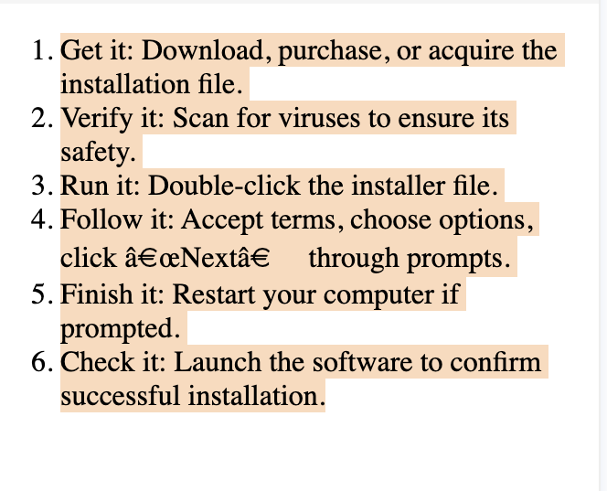

# Class 2 - Introduction to HTML Lists, Forms, and Tables

# Agenda:

- HTML List
- Different Types of Lists
- HTML Forms and its Attributes
- HTML Tables
## List

Suppose you have these two lists in front of you

We have two kinds of Lists

1.  Grocery List


2.  Steps to Install a **Sofware**

 

### 1. Unordered List

Use `<ul>` tags for displaying a list with the help of symbols/shapes.

#### Pseudocode

```html
<!DOCTYPE html>
<html>
<head>
    <title>List Examples</title>
</head>
<body>
    <ul type = "circle">
        <li>Banana</li>
        <li>Apple</li>
        <li>Strawberry</li>
    </ul>
</body>
</html>
```

#### Output:


## 2. Ordered List

An ordered list is used to create a list of items that have a specific sequence or order. Each item in an ordered list is typically numbered, and the numbers usually increment in a sequential manner.
Each list item is defined with the `<li>` (list item) element, this will be more clear further in this article.

An ordered list can store content in two ways as well:

1. Numerically ordered
2. Alphabetically ordered

#### 2.1 Ordered List

In the following code you can clearly see that the output generated now will have an order and by deafut it will start from numbers , 1,2,3..and so on , this is basically numerically ordered list

#### Pseudocode

```html
<!DOCTYPE html>
<html>
  <head>
    <title>List Examples</title>
  </head>
  <body>
    <ol>
      <li>Get it: Download, purchase, or acquire the installation file.</li>
      <li>Verify it: Scan for viruses to ensure its safety.</li>
      <li>Run it: Double-click the installer file.</li>
      <li>Follow it: Accept terms, choose options, click “Next” through prompts.</li>
     <li>Finish it: Restart your computer if prompted. </li>
     <li>Check it: Launch the software to confirm successful installation. </li>
    </ol>
  </body>
</html>
```

You can also use Roman Numbers as well if you set the `type` attribute of the list to `'I'` it will show the order in Roman Numeric Format

#### Output:


### 2.2. Alphabetical Ordered List

In order to structure list in alphabetical fashion we can use `type = "A"` between `<ol>` tags

#### Pseudocode

```html
<!DOCTYPE html>
<html>
  <head>
    <title>Alphabetical Ordered List</title>
  </head>
  <body>
    <h1>Alphabetical Ordered List Example</h1>

    <ol type="A">
      <li>Get it: Download, purchase, or acquire the installation file.</li>
      <li>Verify it: Scan for viruses to ensure its safety.</li>
      <li>Run it: Double-click the installer file.</li>
      <li>Follow it: Accept terms, choose options, click “Next” through prompts.</li>
     <li>Finish it: Restart your computer if prompted. </li>
     <li>Check it: Launch the software to confirm successful installation. </li>
    </ol>
  </body>
</html>
```

You can add type as 'a',  "A" and depending on that the order will be applied

**Output:**


# Question
Which HTML tag is used to create an ordered list?
# Choices

- [ ] \<ul>
- [ ] \<li>
- [x] \<ol>
- [ ] \<dl>
## Tables in HTML


genrally tables are used to organize and display data in a structured format. Tables consist of rows and columns, where each cell is capable of storing data in form of text.

Show an Example of a Table and just highlist each part that there are headings there are data corresponding to headings just like that do not go intp depth right now

* Show this Image-


Now start Explaining how to create a table like this in HTML

 in-order to create tables in HTML one needs to be familiar with certain tags and attributes used such as:

1. `<table>`: tag is used to define the beginning of a table 2.`<td>`: tag represents a table cell that contains data
2. `<tr>`: tag represents a table row
3. `<th>` : tag represents a table header and is used to label columns or provide additional information about the data
4. `<thead>`: tag is used to group the header content in a table. It typically contains one or more `<tr>` elements with `<th>` elements inside.
5. `<tbody>`: tag groups the body content of the table.
6. `<caption>`: tag is used to provide a title or caption for the table. It is placed immediately after the opening `<table>` tag.
7. **border attribute**: is used to specify the thickness of the border around the table and its cells.

example
#### Pseudocode

```html
<!DOCTYPE html>
<html>
  <head>
    <title>Table Examples</title>
  </head>
  <body>
    <table border style="text-align: center;">
      <caption>
        Student's Marksheet
      </caption>
      <thead>
        <th>Student</th>
        <th>Roll No.</th>
        <th>Marks</th>
      </thead>
      <tbody>
        <tr>
          <td>1</td>
          <td>2016911</td>
          <td>98</td>
        </tr>
        <tr>
          <td>2</td>
          <td>2015911</td>
          <td>78</td>
        </tr>
      </tbody>
    </table>
  </body>
</html>
```

#### Output:


`border property looks red because it is now deprecated and we use css now to style the table`
# Question
In an HTML table, what does the \<th> tag represent?
# Choices

- [x] Table header
- [ ] Table data
- [ ] Table row\
- [ ]Table column
---


## HTML Forms

Just like any other forms are used to collect information, in context of HTML it collects user input on a web page. They allow users to enter data, make selections, and submit that information to a server for processing. HTML forms are created using a combination of form-related tags and input elements 

<img src='data:image/png;base64,iVBORw0KGgoAAAANSUhEUgAAAPoAAADKCAMAAAC7SK2iAAACHFBMVEX////u7u74+Pj09PQAAACTk5Oqqqqamprx8fGJiYne3t78/PzExMTT09PPz8/r6+vk5OS7u7vJycng4OA5AAD///snAADB1PGLTg9QfKLx+v/m+f/hu6Xtx60UJVVDXZGPuuTt26+2trYAACaWaUWgoKDLnnR/fJ6Xutj2///lza09IwAAMWT76tJrRSMUBAD///Pd9P8ATHnJo3D/6MBZbWUiAAAAACz58OC64/84UoXo0bRHKQAgQnAAACL//+VymsbW9//O6Py0usN5e37B0d/Wv7GFio/t586YrMGimZCWoKiBfXunv9SykHDz7OAAABKBob+baT1FcpjOs5c0d6m6mm8AADsAKElRJgAAIFhuQwBWAAgAERKCZElLOyuCWB20j5CMlbeCaHNnSD4sVXhsf5KJkaKgc2MPXpdgcZJNRjwAHi5VV3Dm1sORgXdkZWWXgWl6bl9obnqyiVu4loIfEQAAFzHUtIwpOVhgSzN1l6o0Qk1DHABli7kLRmqPtcJVPkxfMwB1MgdhNx1KXW6FdmIzME/CqaI0IxJvXUw/TmrFx9aff5ZbPBJVTVVwZIm0lFlWc7ipgTfuz5u5stFvQ0c6JjLAu6kwNUArOXmPxOF0Uzifaj/Y3O9xY2Lgunpbnct0W2y/yrxaPk+AUlCQeEtGSUxwf7dkaFFNUo7evsR7TGk1CDgwIz9NIDdEgp87SztIcYtnQnLRm2ofAAANS0lEQVR4nO2djX/SZh7AH5JA00BIgGVdyzYrax1wQxNbNyrzSsFgWwoRzTrd7qrrXHV1jX090Trm3Dpd2/ly57Y6PXt2m3i73W3n/YP3PIFqi30XDST5flp4gF/C8+V5eJ68PDwB9gIYhuEQEmIxAtATQG1gXwJmECwWVd2IMIxh1VnWsOqUcdVpCsB2TetcaAJNA8yg6k7jqjuchlV3OQyr7oPqOK51LjTB53qkHtpfa7Vaa/eLiULigJCoRcAkItXZcwAmu4oLhrthTE+SrlVje1Il6w3P1R5IBZ6rymax+R6p28k0QRD1pN0uNRHEwQzOH3o1hfMvEcThBlx+8x2A9cLX340VFszuIogjImbH1YUaSr4zkaPv0e8fzFS0O1THH1X4V14kXvOjxA6CeLUO8E2NAHAvITP4VD0A2//0Z4KIqqF83zGC2OaFqZdfIIjGkrWGdxK7pePqcpVLsw2WOll8UKr+Qcdj9c5+qP7hCYL4SEARNwf61lCP/IHYHYicFJ6fxxZA6uQqpc5ZwGN1O/x8tr+eJQoR/CmxaR315+ewRWrWKHWVRXXE9tc7jxLExzDVOsivod57ehfxyRBq+ZQzwwMivA+PDA8PCeGRASEyOjzc35CYH0sBTkG3mmFtBji5TB1u0nOrqgfGYaPWBrgJ/1rq8uhfiLNQmUsTUS6rLh45SrwmjrxJ5FD7eK5n/3mCmByBtwczz0n0SUrViQvDkGOrqkc+JWD2wz3CWuqowr8BW3f5zVdjoP0oahlDO+Fy8IOLgu0vEEdSILiLOOsHwU+Jw5r1AqXqb61d4QPI+FwsGw2sqR6E6l7Uzn8mAP59uICq3gjCNi9S3ysg9X1eEHmb2O19Hpor8WSFR4nV1QFs6P548UwKbEAdVnLYHfA7iSN1qnpbYSWP1AVVXbMOsHaz6mgT5+CAd0V1RSyuqKj+aVH9bAqpv1XYGKoc9ZpNqoOWXarqCupc72J7XVAPXULq7e8XS7361UNXkdZK6qHPixu5RXUY8hls5i6huIpX30X8sVSd/wJtwxfS2wehOuz5UIeE1PcuUw/f37e4+QbV34OvRd5+tw60vvgWrAyhL4mDhe966/Jmbl8lqIdqYWdLXDgpJs7Azu3glBWK8N1fwfp9dizegPbVzp8dg3tjrZfhNu6Vr74miE/G4h4rWmgG7tOdOU9sK6rL0/AzHIRffOXElHV0BprzabiaGdQUhO7D5XKdp+A7TCoorl+r3m2JetjncLvdjrggFRIuqMs7XDDpdokwLbkcMBEAnAT/E4Xn3YyrEAtxuMXioV0FvRi/C1M87ZpFapwbhjk86F1QYlZCS4kSipvVqtiXVXhjYaobEVPdiJjqRsRUNyKmuhEx1Y2IqW5ETHUjYqobkadVZ2ltoJ5+6NNTqtvdjDaj2d2WZ6AuMZtRd2o08Iwuq7q8v3Z/T38gu5kD4zpRDx+qZ6VvOuyPR9FJs+strhN1sCMKWE/hhAAGOBzw6UzhnAIO7zg1CD6LoQgMfj5oLLlu1Ie6BwR+5GJ4PjkvfpA8qVyd8QOgTKfSH3lD86P1ZHpg7lqXfPo2GiKTCfTmdKQ+OHdA4NOT0nG/lLjOxgM3GgEaCnK7fb4t2Nh6WewdDGS3gexf26fHRn+ISXd1pB4FlgaQPRn4221Y2fMZoKrzTW3t03V8d/fl2M3BgPwOVG8di2G4+l3QkTq6HQBQXfq287vYjUayqN7Wcq99pu5mPVDV23cO+JJeNIZCJ+rysXPwqx06P2P7cq83/M1XsJ9Dp4WzXw/MfV0vz7h+Tk6fizcdid9/VYxcPZsBvVHdqG8FU/35UwnqGv1QrALUHU5t9txcmqsDTJsdNwv59LXNPFRhREx1I2KqGxFT3YiY6kbEVDciT6nuc2iDS3t1RxmyoNX7LlG3Y5ufoEYn6tnTt7qWnW7D1z/4pBN1bjy33NW1/u/PdaJePA7PKT4xwDlFS+T7JHTHKcYhAM4dF4DEKrOYIjYA3jHbwNF3y5SFrfBs1CNjrmuxRHIuo5zvEgAv30rJ2xrSFye2dV6KKvMZ54k23tY8nVNnc9CZetilnG57eSh+l+9DP0dsX+gIzQgJKv1DoLcRTGTA+O1gHp2HL1sWtsKzUOdoyeruE8NXpifJoroQuiDIyblfAuNF9ZuHA4DUlTo+Xs+yE3U76qU7XXPfKteZvhQLQOvnbZFb4p1U8LLQFOVPRfm/Z8J3buUz3IS/TFnYCmVWDx6w1tYmhXB3KpGSEjV3gdIFW7Q5a3yuNqVYaZvbmnR2JxXrSW+oOynwiboyZWErlLvCa5QFrd7XVNcyC1vAXgnqTrcGON0VoK7V9LflOL9rHqowIqa6ETHVjYipbkRMdSNiqm8UC6MRz2A86ubUMZeH0gKPm9JG3W4HXGFXCXOXPwcbgn226orD4XI5VpgHTE7x6jFI/apHzs9YraN1T8YoIn/onprSqzo6Ds+j3/KsQEtUvdOves4eVCfG5BJd8oBnYlAAkflBgZNFpC53BfSr3jKz/44f2ElSOv5OYLw+MB4NzXvH74XudCF1JaVjdVjhQyLI5vN1/8iBlknV17fzHhjv0n+Fj6LJIJWaZqGgno2GFmIti+q4Rb/qkasz1tpRNFFq+Pg+eufuH+HfiYu9h5Wrhz1XPxOyOf1WeImmnU4a9escRTM0baHpBonCWZymSJRk9FvqG8DY6nYtqAB1uwN+J7TAwWqtrtmJprKcaXo6dT1hqhsRU92ImOpGxFQ3Iqa6ETHVjYip/gi7x+mkVtlDfBZ7jhpSoo45KYahnOpEg1xiv3qR2fCZpHoiLni5sq/AuVmWq9tpimFZhqbVR9KhN2LoUmVnC5fZjUzHVllJdbJcHXdQHkTxJ6M381F0sc2FDoCzDSDcFwMc+/SzAFUKy9VJR+FMvk99xGXjlzuAbFvoCPXUDsWgOu/qnhdXXVeVsVwdg6UOzalCqXNZoamxvb9zoaM1E/4uFe4TgvnhY7mKvtDyJihp5ihU4+GN+oDLxm5+dKUttNDBz9l+guodLffgs1pltdyUqNtpl8Phogu9GFTnv/g4EFno2JHjf/ajUr+V7O7SaakDYKGo4szJnJx/IART4fv5AWW4a8Ivn34QkE9P6aaZX2trjmQYNHcuwzDA0sBhOGMBnKWiryu+KcwNWSNiqj8GYxh81WhdUarucdK0s3haE7dYGGalGiEl9dDYlaizTgb6Ftw5+dhM7Wj9k904l53RQw9XsiHrplgIVfjdJJd+APj4CgXcukd/6st3X0D6AfmNF/BXkoI057kiSt0i4BPWlKqudK/0oVQTT+y0qhTVdxz55y8C3107vXfuRX/wXCoxJMiDyk8dUH37WM/3Ga0yXR5KDlW4abTn5iyOFoIV/l/eyHCzLdXe1NE+FON/jUlO+d9IfXzAZqvy3deSZs7icno8zsVZiaG6HUSuxQDTvhOph38VgpM0KnVhPAfbRI3yXCZKOzfS6XI5ix271PQAXWM+TRD1nZdut/7Hr/yWujGpfNcWvFDXepQ4ktImy+XiiU0a+6MhO5xi86E6HXbEGxSbg/aJim9W8onOuwqs64pPrPIDtOaGrBEx1Y2IqW5ETHUjYqobEVPdiJjqRsRUR7CuDc1P7saB3b1u1GqjsCqIJeou+4Z+e0R5AEuvF2p3VP4pnKXqGK6CFe9XpqhejFwtFHNXozpJUWQh/xZmicyjB0jdiaEQhvJQDEYucy48IrEqK3WYIEnpzJ7pkyxK4cFJjlwEj1xU4mqKRuooVBqZGh6eiuHkMiQ1Cq8ydRJdIq43B7iRFMOSLCv/LlEWi4eiGIqyMEz2MIsCkLobhylptA3jJh4EJBpWEwrekCztweWHalS1qTMwz/JUUiTxln5sR3/wv9Zpf+i3A/Nj1mF/djJ9TkTXz1PVUag0mrJIp6LhEeuH/s4Prdc6Ej3WBbH3XIq0MNWmrs6yZJGP5QeF3n482x/8HWv95cefYsGH3mw0+/srOTVAVUcpqe/CcH7SMjHomNgzMRT3SCOTjpFc8CF6zVJl6upkT7QFC/dlWvpxuV/O4O3/+/G6EHzIIHU5xyyqO1T1njb+VD2ZflhjjTNz01O+voGaGhEGI3VXlamjE8wjuQB2I5Ot58Zz8pT3lW2d12Gps71QPfgABTBOCqqjQcSowivn/dn6QNiXmMV7B0YyQJkNbrOgqOpS96nqykg+f5FVTg2f6UrsmZ4SO18XIpOsnJEnlT4/ilhUZ6VukWXkh550Pp9S5vODYufP+TGxs68LrabK1NkCFBpe4KE8xaQH/aHh0oUXWDdSVwM9anQhilJDqeKj6lNXB4QjVXTrWRlV3bXsVXb5jZqoNvUNoaoz60W5Kn9vcIm6w7UhfCxgfOuHaXSZ6k2wRB3bWKmjcbPrFjpb+YVuHqrQOheaYKobEVPdiJjqRsRqqhsQa7OR1THjqhu11GtsqNRJC8N6KJp2utFs4T6ITd8gxWYbwHHVXBV3Ienm5uaamhqrjqmpgY42WOqqOosK3VFwR/Kqvj5R7VDR/x+a9foFytjP2gAAAABJRU5ErkJggg=='/>


`Take one by one each Element and start building a Survey form` 

1. `<form>`: tag defines the beginning of a form and contains the elements that make up the form, such as text fields, checkboxes, and buttons. 
2. `<input>`: The `<input>` tag is used to create various types of form input fields. The type attribute specifies the type of input field to be displayed. Common type values include:
   - **text:** Creates a single-line text input.
   - **password:** Creates a password input field (text is masked for security).
   - **checkbox:** Creates a checkbox for binary (true/false) choices.
   - **radio:** Creates a radio button for selecting one option from a group.
   - **submit:** Creates a submit button to send the form data.
   - **button:** Creates a generic button.
   - **file:** Allows users to upload files.
   - **date, email, number, and more:** Various input types for specific data formats.
3. `<label>`: tag is used to associate a label with a form element, making the form more accessible and user-friendly. The for attribute of the `<label>` tag should match the id attribute of the form element it labels.
4. `<select>`: tag creates a dropdown list, allowing users to select one option from a list of choices. It contains one or more `<option>` elements.
5. `<option>`: tag defines an individual item in a `<select>` dropdown list. The value attribute specifies the value that will be sent to the server when the form is submitted.
6. `<button>`: acts as an input element in HTML and is used for various purposes in a form including the submission of a form. We have different types of input elements as well such as checkboxes `<input type = "checkbox">`, radio buttons `<input type = "radio">`, and other input elements as needed to gather user input

#### Pseudocode

```html
<!DOCTYPE html>
<html>
  <head>
    <title>List Examples</title>
  </head>
  <body>
    <form>
      <label>Name</label>
      <input type="text" />

      <label>Email</label>
      <input type="email" />

      <label>Phone</label>
      <input type="number"  />

      <!-- If you want to restrict the number to a certain digit use pattern -->
      <input type="text" name="phoneNumber" pattern="\d{10}" maxlength="10" title="Enter a 10-digit phone number">

      <label>age</label>
      <input type="number" min="1" max="100" />

      <label>Birthday</label>
      <input type="date" min="1905 - 06 - 18" max="2002 - 06 - 10" />

      <p>Food</p>
      <label>Apple</label>
      <input type="checkbox" />
      <label>Orange</label>
      <input type="checkbox" />
      <label>Banana</label>
      <input type="checkbox" />

      <p>Gender</p>
      <label>Male</label>
      <input name="gender" value="male" type="radio" />
      <label>Female</label>
      <input name="gender" value="female" type="radio" />

      <label>Eyecolor</label>
      <select>
        <option>Blue</option>
        <option>Black</option>
        <option>Red</option>
      </select>
    </form>
  </body>
</html>
```

#### Output:


# Question
Which HTML tag is used to create a drop-down list in a form?
# Choices

- [ ] \<input type="dropdown">
- [x] \<select>
- [ ] \<list>
- [ ] \<dropdown>
---


